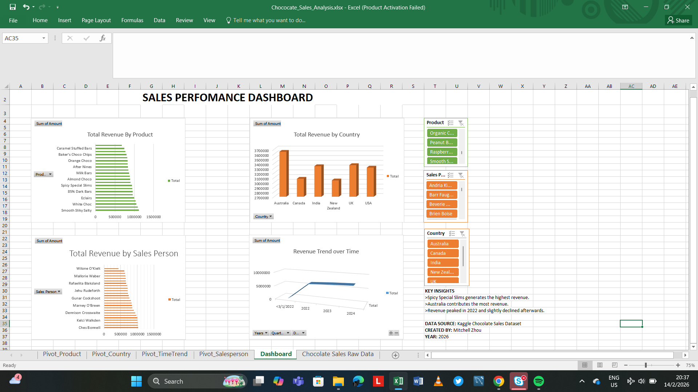

# chocolate-sales-excel-dashboard
Sales performance dashboard built in Excel using data cleaning, Pivot Tables and trend analysis.
PROJECT OVERVIEW
This project analyzes chocolate sales data using Microsoft Excel. The goal was to clean raw sales data and create an interactive dashboard to visualize revenue performance.
DATASET
The dataset contains:
>Sales Person
>Country
>Product
>Date
>Revenue (USD)
>Boxes shipped
DATA CLEANING
>Removed currency formatting issues
>Converted text values to numeric values
>Corrected date formatting
>Created Pivot Tables for aggregation
ANALYSIS PERFORMED
>Total Revenue by Product
>Total Revenue by Country
>Total Revenue by Sales Person
>Revenue Trend Over Time (grouped by year)
DASHBOARD FEATURES
>Interactive slicers (Product, Salesperson, Country)
>Bar Charts for categorical comparison
>Line chart for time trend analysis
>Key insights summary
TOOLS USED
>Microsoft Excel
>Pivot Tables
>Slicers
>Basic data cleaning functions (VALUE,SUBSTITUTE)
